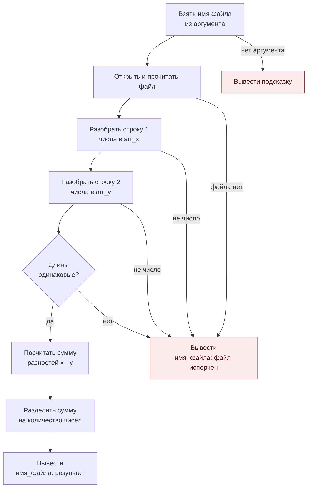
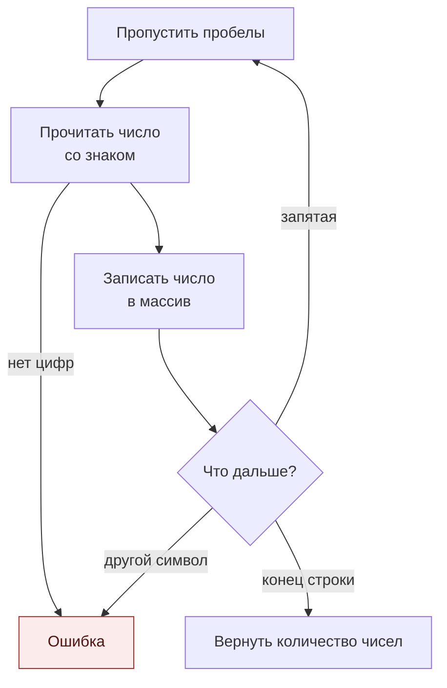

# average

Программа на языке ассемблера NASM. Читает из файла два массива чисел `x` и `y` и находит среднее арифметическое разностей `x[i] - y[i]` 

## Формат входного файла

Две строки, числа через запятую. Количество чисел в строках одинаковое.

```
5, 3, 2, 6, 1, 7, 4
0, 10, 1, 9, 2, 8, 5
```

## Формат вывода

```
<имя_файла>: <среднее арифметическое>
```

Пример:

```
data.txt: -1
```

Если файл не найден, содержит нечисловые данные, пустой или количество чисел в строках различается:

```
<имя_файла>: файл испорчен
```

Если имя файла не передано, программа выводит подсказку по использованию и завершается с кодом 1.

## Структура

```
average/
├── main.asm    # исходный код
├── Makefile    # сборка и запуск
├── data.txt    # пример входного файла
└── README.md
```

## Требования

- ОС: Linux
- Процессор: x86-64 (на ARM-Linux программа не запустится)
- Установленные: `nasm`, `make`, `ld` 


## Запуск на Linux

Установка инструментов 

```
sudo apt update
sudo apt install nasm make binutils
```

Сборка и запуск (из папки `average`):

```
make          # сборка, получится исполняемый файл average
make run      # запуск на data.txt
```

Запуск на своём файле:

```
./average data.txt
```

Очистка собранных файлов:

```
make clean
```

## Запуск на macOS (через Docker)


1. Установить [Docker Desktop](https://www.docker.com/products/docker-desktop/) и запустить его.
2. В терминале перейти в папку `average`:

```
cd путь/до/average
```

3. Выполнить команду:

```
docker run --rm --platform linux/amd64 -v "$(pwd)":/app -w /app ubuntu:latest bash -c "apt-get update && apt-get install -y nasm make binutils && make clean && make run"
```

Ожидаемый вывод в конце:

```
data.txt: -1
```

Команда работает и на Mac с процессором Intel, и на Mac с чипами Apple (M1/M2/M3/M4). 


## Ограничения

- Размер входного файла до 64 КБ.
- До 8192 чисел в одной строке.
- Числа целые, допускаются знаки `+` и `-`, пробелы и табуляции вокруг запятых, переводы строк `\n` и `\r\n`.

## Как работает программа

### Общая схема



### Как читается одна строка (parse_line)



### Пример на data.txt

| Массив      | 0 | 1  | 2 | 3  | 4  | 5  | 6  |
|-------------|---|----|---|----|----|----|----|
| `arr_x`     | 5 | 3  | 2 | 6  | 1  | 7  | 4  |
| `arr_y`     | 0 | 10 | 1 | 9  | 2  | 8  | 5  |
| `x[i]-y[i]` | 5 | -7 | 1 | -3 | -1 | -1 | -1 |

Сумма разностей = -7, чисел 7, результат -7 / 7 = -1.

Вывод программы: `data.txt: -1`


###  Регистры

| Регистр | Что хранит |
|---------|------------|
| `r15`   | указатель на имя файла (`argv[1]`) |
| `r14`   | дескриптор открытого файла |
| `r13`   | сколько байт прочитано, затем адрес конца данных в `buf` |
| `r12`   | текущая позиция в тексте, затем результат деления |
| `rbx`   | количество чисел в первой строке |
| `rcx`   | индекс `i` в цикле суммы, затем делитель 10 при выводе |
| `rsi`   | сумма разностей |
| `r8`    | в `parse_line` — счётчик чисел, при выводе — длина строки |
| `r9`    | флаг «число отрицательное» |
| `r10`   | в `parse_line` — количество собранных цифр |
| `rdi`   | адрес массива (при вызове `parse_line`), затем указатель в `outbuf` |
